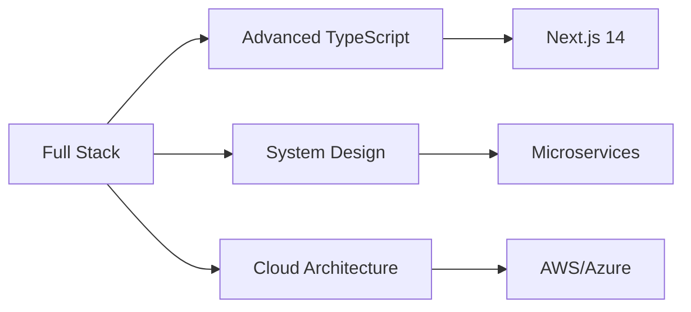

  

<h3 align="center">👨‍💻 Full Stack Developer especializado en Python, React y TypeScript</h3>

  Construyendo soluciones modernas y escalables. Apasionado por el aprendizaje continuo y la excelencia técnica.

---

## 🛠️ Tech Stack

*Frontend*

  
  
  
  
  

*Desktop & TUI (Python)*

  
  
  

**Backend**

  
  
  
  
  

**Database**

  
  
  

**Tools & Others**

  
  
  

---

## 📊 GitHub Stats

  
  

  

---

## 📈 Contribution Graph

  

---

## 🚀 Featured Projects

> 💡 **Próximamente**: Migrando proyectos desde GitLab. Stay tuned!

<!-- Cuando migres proyectos de GitLab, usa este template:

**Nombre del Proyecto**
- Descripción breve del proyecto
- Tech stack: Python, React, PostgreSQL
- [Demo en vivo](link) | [Código](link)

-->

---

## 📚 Currently Learning

**En progreso**:
- 🎯 Arquitectura de microservicios
- 🎯 Patrones de diseño avanzados
- 🎯 Cloud computing (AWS/Azure)

---

## 🤝 Connect With Me

  
  

 

  

---

  <i>Open to collaborations and interesting projects!</i>

